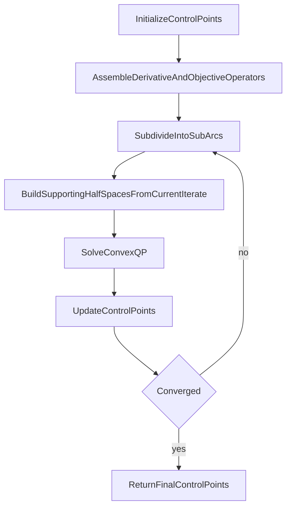

# Method Artifact Pack

This document is the merge-ready output of the method-core workstream. It freezes the formal safety boundary, provides a draft `T1`, and specifies `F1` and `F2` tightly enough that later manuscript assembly does not have to rediscover the method structure.

## Scope

This pack owns:

- formal safety statement for spherical-KOZ conservatism
- `T1. Control-point-space objects and linear maps`
- `F1. Representative KOZ linearization on one sub-arc`
- `F2. SCP pipeline in control-point space`

It does not own results interpretation, downstream warm-start claims, or degree-ablation conclusions.

## Formal safety statement

### Proposition

Fix a subdivided sub-arc `s` with control polygon `P^{(s)} = S^{(s)} P`. Let the spherical keep-out zone be

`K = { r in R^3 : ||r - c_KOZ||_2 <= r_e }`.

Construct the representative point as the centroid of the subdivided control polygon,

`c^{(s)} = (1 / (N + 1)) sum_{k=0}^N q_k^{(s)}`,

and define the supporting-half-space normal by

`n^{(s)} = (c^{(s)} - c_KOZ) / ||c^{(s)} - c_KOZ||_2`,

whenever the denominator is nonzero. Let the supporting half-space be

`H^{(s)} = { r : (n^{(s)})^T r >= (n^{(s)})^T c_KOZ + r_e }`.

If every control point `q_k^{(s)}` of the subdivided control polygon lies in `H^{(s)}`, then the entire Bezier sub-arc lies in `H^{(s)}` and therefore outside `K`.

### Assumptions that must stay explicit

1. The obstacle is spherical.
2. The normal is constructed from the centroid of the subdivided control polygon.
3. The same supporting half-space is enforced on all control points of that sub-arc.
4. The centroid does not coincide with the KOZ center in the normal-construction step.

### Proof sketch boundary

- A Bezier curve lies in the convex hull of its control points.
- A supporting half-space of a sphere excludes the interior of that sphere while touching the boundary.
- Therefore, if all sub-arc control points lie in the supporting half-space, the full sub-arc lies there as well.

### Forbidden overreach

- arbitrary obstacle geometry
- unconditional continuous safety
- a global obstacle-avoidance theorem

## T1 draft: Control-point-space objects and linear maps

| Object / operator | Dimensions | Definition | Role in the optimization |
|---|---|---|---|
| `P` | `(N+1) x 3` | control-point matrix | convenient matrix form of the decision variables |
| `x` | `3(N+1)` | stacked control-point vector | primary optimization variable |
| `D_N` | `N x (N+1)` | Bezier difference matrix | maps control points to derivative-space coefficients |
| `E_M` | `(M+2) x (M+1)` | degree-elevation matrix | lifts derivative control points back to the original degree basis |
| `L_{1,N}` | `(N+1) x (N+1)` | `E_{N-1} D_N` | degree-preserving velocity map |
| `L_{2,N}` | `(N+1) x (N+1)` | `E_{N-1} D_N E_{N-1} D_N` | degree-preserving acceleration map |
| `G_N` | `(N+1) x (N+1)` | Bernstein Gram matrix | exact integral operator for L2 terms in the Bernstein basis |
| `tilde G_N` | `(N+1) x (N+1)` | `L_{2,N}^T G_N L_{2,N}` | quadratic operator for the legacy acceleration-energy form |
| `S^{(s)}` | `(N+1) x (N+1)` | equal-parameter subdivision matrix for sub-arc `s` | maps whole-curve control points to sub-arc control points |
| `P^{(s)}` | `(N+1) x 3` | `S^{(s)} P` | control polygon of sub-arc `s` |
| `q_k^{(s)}` | `3` | `k`th row of `P^{(s)}` | control point constrained by the KOZ half-space |
| `c^{(s)}` | `3` | centroid of `P^{(s)}` | representative point used to construct the KOZ support plane |
| `n^{(s)}` | `3` | normalized `c^{(s)} - c_KOZ` | outward half-space normal for sub-arc `s` |
| `A_KOZ^{(k)}, b_KOZ^{(k)}` | row stack | linearized KOZ inequalities at SCP iteration `k` | enforce conservative continuous exclusion under the current iterate |
| `A_bc, b_bc` | row stack | endpoint velocity / acceleration equalities | boundary-condition rows in the convex subproblem |
| `H^{(k)}, f^{(k)}` | QP matrix/vector | weighted quadratic objective at SCP iteration `k` | define the convex subproblem solved each outer iteration |

### T1 note on wording

The safe `C4` language is `structured and reusable`, not `efficient`, unless a benchmark is added separately.

## F1 specification: Representative KOZ linearization on one sub-arc

### Intended scientific job

- illustrate the geometric content of `C2`
- make the sub-arc, support point, normal, and supporting half-space auditable
- support, but not replace, the formal proposition above

### Required panels

1. Whole-curve view:
   - full curve
   - equal-parameter sub-arcs
   - one highlighted violating sub-arc
   - spherical KOZ
2. Local geometric construction:
   - highlighted sub-arc control polygon
   - centroid `c^{(s)}`
   - normal `n^{(s)}`
   - supporting half-space boundary
3. Corrected feasible view:
   - same sub-arc after the supporting-half-space constraint is enforced
   - control polygon visibly on the safe side of the boundary

### Required labels

- `K` or `KOZ`
- `c_KOZ`
- `r_e`
- `c^{(s)}`
- `n^{(s)}`
- `H^{(s)}`
- sub-arc control points `q_k^{(s)}`

### Source inputs

- centroid-based KOZ construction in `orbital_docking/constraints.py`
- sub-arc construction in `orbital_docking/de_casteljau.py`
- legacy illustration logic in `figures/legacy/constraint_linearization_figures.py`

### Caption draft

`Representative KOZ linearization on one subdivided sub-arc. The spherical keep-out zone is conservatively excluded by constructing a supporting half-space from the centroid of the sub-arc control polygon and enforcing that half-space on all control points of the subdivided sub-arc. This construction is specific to the spherical-KOZ setting and should not be read as a general obstacle-avoidance theorem.`

## F2 specification: SCP pipeline in control-point space

### Intended scientific job

- defend `C3`
- show what is fixed, what is rebuilt, and why each outer iteration is a convex QP
- absorb the generic framework-overview role so a second overview figure is unnecessary

### Locked step order

### Convex / relinearized split that the figure must show

- fixed or reusable structure:
  - control-point variable
  - derivative operators
  - degree-elevation operators
  - boundary rows
- rebuilt each SCP iteration:
  - supporting half-spaces
  - gravity linearization terms
  - IRLS weights in `dv` mode

### Caption draft

`SCP pipeline in control-point space. The method initializes a control polygon, assembles reusable derivative and objective operators, subdivides the current iterate into sub-arcs, rebuilds supporting half-spaces and other local linearizations, solves a convex quadratic subproblem, and repeats until convergence. The original trajectory problem is not exactly convexified in one shot; the method solves a sequence of convex QPs inside an outer SCP loop.`

## Immediate lift targets for manuscript assembly

- `T1` feeds Section 3 directly.
- The formal safety statement and `F1` feed Section 4.2 directly.
- `F2` feeds Section 4.3 directly.
