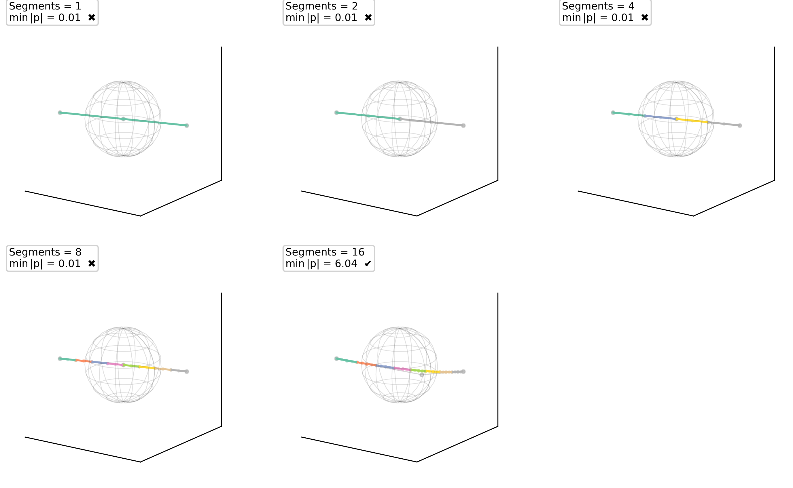
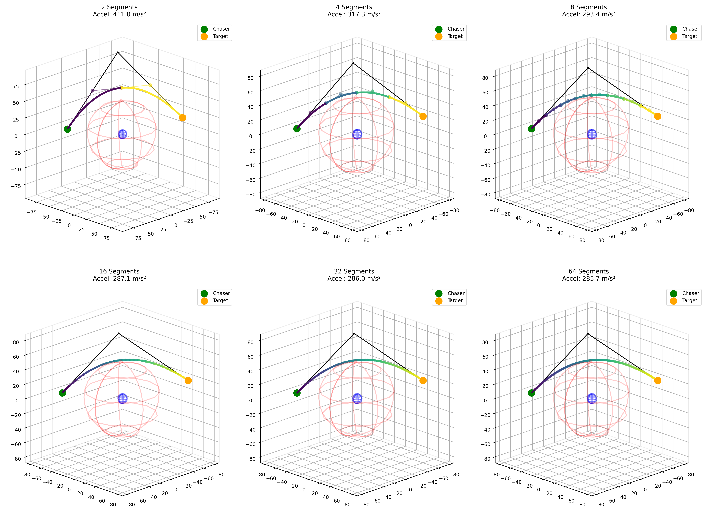

# 세그먼트별 컨벡스화에 기반한 Bézier 궤적 초기화 기법

부제: Orbital transfer 예제에 대한 적용

---

**초록**

본 논문에서는 구형 Keep-Out Zone(KOZ)을 연속적으로 회피하는 Bézier 기반 궤적 초기화 프레임워크를 제안한다. 제안 방법은 전적으로 제어점(control point) 공간에서 작동하며, 미분 연산자, 분할(subdivision) 행렬, 경계조건, KOZ 제약을 모두 제어점에 대한 선형 연산으로 표현한다. 구형 KOZ 회피는 De Casteljau 분할로 곡선을 여러 분할구간(sub-arc)으로 나눈 뒤, 각 분할구간의 제어다각형에 지지 반공간(supporting half-space) 제약을 부과하는 방식으로 보수적으로 처리한다. Bézier 곡선의 볼록 껍질(convex hull) 성질에 따르면 해당 분할구간의 모든 제어점이 반공간 제약을 만족할 때 곡선 전체도 KOZ 바깥에 놓이게 된다. 최종 최적화는 순차 컨벡스화(successive convexification) 절차 안에서 일련의 convex QP를 푸는 방식으로 수행된다.

제안한 기법은 단순화된 orbital transfer 문제에 적용하여 검증하였다. 분할 수와 Bézier 차수에 대한 변화 실험을 통해 계산 비용, 안전 여유, 그리고 대리 목적함수의 변화를 비교함으로써 정식화의 거동을 정량적으로 살펴보았다. 제안한 프레임워크는 후속 solver에 전달할 수 있는 매끄럽고 연속적으로 안전한 warm start 초기값을 생성하는 데에도 활용될 수 있다.

---

## 1. 서론

제약이 있는 궤적 최적화 문제는 항공우주, 로봇공학, autonomous systems 등 여러 분야에서 반복적으로 등장한다. 이때 중요한 요구 가운데 하나는 궤적이 특정 금지 영역을 경로 전체에 걸쳐 지속적으로 회피해야 한다는 점이다. 그러나 일반적인 direct transcription 또는 direct collocation 방식에서는 제약식이 주로 이산화된 지점에서만 강제되므로, 노드 사이 구간의 안전은 별도로 확인해야 하는 경우가 많다. 따라서 이산화된 지점만이 아니라 연속 구간 전체에서 안전을 다룰 수 있는 표현과 제약 방식이 필요하다.

또 다른 실용적 문제는 초기값의 품질이다. 많은 후속 solver는 초기값에 민감하며, 초기값이 좋지 않으면 제약을 만족하지 않는 해로 수렴하거나 반복 횟수가 크게 증가하거나 품질이 낮은 국소해에 머무를 수 있다. 이런 점에서 후속 고충실도 최적화에 앞서 매끄럽고 제약을 만족하는 초기 궤적을 생성하는 절차는 그 자체로 의미가 있다.

본 논문은 이러한 문제를 해결하기 위해 Bézier 곡선을 이용한 궤적 초기화 기법을 제안한다. 제안한 기법의 핵심은 모든 계산을 제어점 공간에서 수행한다는 점이다. 곡선의 미분, 분할, 경계조건, KOZ 제약이 모두 제어점에 대한 선형 연산으로 정리되므로, 계산 구조가 비교적 단순하고 해석도 명확하다. 특히 구형 KOZ에 대해서는 분할된 각 분할구간에 지지 반공간을 부여하고, 그 반공간 안에 제어다각형이 놓이도록 함으로써 연속 안전을 보수적으로 확보한다.

본 논문의 기여는 다음과 같이 정리할 수 있다.

1. Bézier parameterization을 기반으로 제어점 공간에서 직접 작동하는 궤적 초기화 정식화를 제시하여 제약 구성과 계산 구조를 단순화한다.
2. De Casteljau 분할과 지지 반공간을 이용하여 구형 KOZ를 연속적으로 회피하도록 하는 보수적 제약 구성 방식을 제안한다.
3. 논컨벡스 KOZ 제약을 각 SCP 반복에서 재선형화하면서 일련의 convex QP를 푸는 SCP 기반 절차를 정리한다.
4. 단순화된 orbital transfer 문제에서 분할 수와 Bézier 차수에 대한 변화 실험을 수행하여 계산 비용과 성능의 관계를 분석한다.

이후 구성은 다음과 같다. 2절에서는 관련 연구와의 관계를 정리하고, 3절에서는 문제 설정과 표기법을 소개한다. 4절에서는 제안 기법의 수학적 구성과 알고리즘을 설명한다. 5절에서는 실험 설정을 기술하고, 6절에서는 결과를 제시한다. 7절에서는 한계와 해석 범위를 정리하며, 8절에서 결론을 맺는다.

---

## 2. 관련 연구 및 위치 설정

본 절에서는 제안 기법을 세 가지 맥락에서 살펴본다. 첫째는 direct transcription 및 direct collocation 계열의 궤적 최적화 방법, 둘째는 obstacle avoidance를 위한 컨벡스화 또는 보수적 안전 처리 방식, 셋째는 후속 최적화를 위한 초기화와 warm start 생성 방법이다.

### 2.1 Direct transcription 및 direct collocation과의 관계

Direct transcription과 direct collocation은 제약이 있는 궤적 최적화에서 가장 널리 쓰이는 방법들이다. 이들 방법은 궤적을 여러 노드에서의 상태와 입력 변수로 이산화하고, dynamics를 equality constraint로 부과한 뒤, 큰 규모의 nonlinear program을 푼다. 다양한 문제에 적용 가능하고 solver 생태계도 잘 갖추어져 있다는 장점이 있다.

다만 점별 이산화에 기반한 이러한 정식화에서는 연속 구간 전체의 안전을 직접 다루기 어렵고, 초기값의 품질 또한 수렴 거동에 큰 영향을 줄 수 있다. 본 논문은 이러한 지점에서 제어점 공간 정식화와 보수적 연속 안전 제약 구성을 제시하며, direct collocation은 제안 프레임워크가 연계될 수 있는 중요한 downstream 비교 대상 가운데 하나로 위치시킨다.

### 2.2 보수적 장애물 처리 및 컨벡스화

연속적인 장애물 회피에서는 이산화된 노드에서의 제약 만족만으로 노드 사이 구간의 안전을 보장하기 어렵다. 이를 다루기 위한 여러 접근 가운데 일부는 특정 문제 클래스에 대해 무손실 컨벡스화를 사용하고, 또 다른 일부는 순차 컨벡스화로 논컨벡스 제약을 반복적으로 선형화한다.

본 논문은 순차 컨벡스화의 틀을 사용하되, 점별 상태 제약이 아니라 Bézier 분할구간의 제어점에 제약을 가하는 형태로 적용한다. 구체적으로는 분할된 각 분할구간에 대해 구형 KOZ를 지지하는 반공간을 만들고, 제어점이 그 반공간 안에 위치하도록 한다. 이 방식은 보수적인 회피를 제공하며, 볼록 껍질 성질을 이용하여 분할구간 전체의 연속 안전을 논할 수 있다는 장점이 있다.

### 2.3 초기화 및 warm start 생성

초기값의 품질이 비선형 궤적 최적화의 수렴 거동에 큰 영향을 준다는 점은 잘 알려져 있다. 실제로는 직선 보간, 경험적 형상화, 단순 모델 해, 데이터베이스 기반 초기화 등 다양한 방식이 사용된다. 그러나 단순한 초기화는 연속 안전을 반영하지 못하는 경우가 많다.

본 논문의 제안 기법은 이러한 초기화 방법들과도 연결될 수 있다. 즉, 제어점 공간에서 구성한 매끄럽고 안전한 궤적은 후속 solver의 warm start 초기값으로 활용될 수 있다. 그러나 이러한 downstream 활용 가능성은 본 프레임워크의 핵심 정체성을 대체하는 것이 아니라, 제어점 공간 정식화와 연속 안전 제약 구성이 제공하는 실용적 가치의 한 형태로 이해하는 것이 적절하다.

---

## 3. 문제 설정 및 표기법

### 3.1 궤적 표현과 결정 변수

궤적은 정규화된 매개변수 $\tau \in [0,1]$ 위에서 정의된 차수 $N$의 Bézier 곡선으로 표현한다.

$$
\mathbf{r}(\tau) = \sum_{i=0}^{N} B_i^{N}(\tau)\,\mathbf{p}_i
$$

여기서 $B_i^N$은 Bernstein 기저다항식이고, $\mathbf{p}_i \in \mathbb{R}^3$은 $i$번째 제어점이다. 제어점을 행렬로 모으면

$$
P = [\mathbf{p}_0^{\mathsf{T}}, \mathbf{p}_1^{\mathsf{T}}, \ldots, \mathbf{p}_N^{\mathsf{T}}]^{\mathsf{T}} \in \mathbb{R}^{(N+1)\times 3}
$$

가 되고, 이를 하나의 벡터로 쌓으면

$$
\mathbf{x} = [\mathbf{p}_0^{\mathsf{T}}, \mathbf{p}_1^{\mathsf{T}}, \ldots, \mathbf{p}_N^{\mathsf{T}}]^{\mathsf{T}} \in \mathbb{R}^{3(N+1)}
$$

를 얻는다. 본 논문에서 최적화의 결정 변수는 $\mathbf{x}$이며, 이후의 미분 연산, 분할, KOZ 제약은 모두 이 벡터에 대한 선형 연산으로 표현된다.

본 연구에서는 전이 시간 $T$를 고정한다. 물리 시간 $t$와 정규화 매개변수 $\tau$의 관계는

$$
t = T\tau
$$

로 둔다. 따라서 실제 속도와 가속도는 $\tau$에 대한 미분에 각각 $1/T$, $1/T^2$를 곱한 형태로 얻어진다. 본 논문은 free final time이나 timing allocation은 다루지 않는다.

### 3.2 미분 연산자와 경계조건

Bézier 곡선의 미분 구조는 표준 차분 행렬 $D_N$으로 정리할 수 있다. 여기서 $D_N = N[d_{ij}] \in \mathbb{R}^{N\times(N+1)}$이며, $d_{i,i}=-1$, $d_{i,i+1}=1$, 그 밖의 항은 0이다.

또한 미분된 제어점을 다시 원래 차수의 basis 위에서 표현하기 위해 degree elevation matrix $E_M$을 사용한다. 이를 이용하면 차수 보존형 속도 및 가속도 연산자를

$$
L_{1,N} = E_{N-1}D_N, \qquad L_{2,N} = E_{N-1}D_N E_{N-1}D_N
$$

로 쓸 수 있고, 대응하는 제어점은

$$
P^{(1)} = L_{1,N}P, \qquad P^{(2)} = L_{2,N}P
$$

이다.

물리적인 속도와 가속도는 다음과 같다.

$$
\dot{\mathbf{r}}(t) = \frac{1}{T}\frac{d\mathbf{r}}{d\tau}, \qquad \ddot{\mathbf{r}}(t) = \frac{1}{T^2}\frac{d^2\mathbf{r}}{d\tau^2}
$$

끝점 위치는 첫 번째와 마지막 제어점을 고정하여 부과한다. 끝점 속도는

$$
\dot{\mathbf{r}}(0) = \frac{N}{T}(\mathbf{p}_1-\mathbf{p}_0), \qquad \dot{\mathbf{r}}(T) = \frac{N}{T}(\mathbf{p}_N-\mathbf{p}_{N-1})
$$

로 주어지며, 필요할 경우 끝점 가속도도 같은 방식으로 선형 제약식으로 표현할 수 있다.

### 3.3 Gram matrix와 quadratic form

Bernstein basis의 Gram matrix는 닫힌 형태로 계산할 수 있으며,

$$
[G_N]_{ij} = \frac{\binom{N}{i}\binom{N}{j}}{\binom{2N}{i+j}(2N+1)}, \qquad i,j=0,\ldots,N
$$

로 쓴다. 이를 가속도 연산자와 결합하면

$$
\tilde G_N = L_{2,N}^\top G_N L_{2,N}
$$

을 얻고,

$$
\int_0^1 \left\|\frac{d^2\mathbf{r}}{d\tau^2}\right\|_2^2 d\tau = \mathrm{tr}(P^\top \tilde G_N P) = \mathbf{x}^\top (\tilde G_N \otimes I_3)\mathbf{x}
$$

의 정확한 quadratic form으로 정리된다. 본 논문에서 이 구성은 재사용 가능한 연산자 체계의 일부이다.

---

## 4. 제안 방법

### 4.1 분할과 지지 반공간을 이용한 구형 KOZ 처리

구형 KOZ를 다음과 같이 정의한다.

$$
\mathcal{K} = \left\{\mathbf{r}\in\mathbb{R}^3 : \|\mathbf{r}-\mathbf{c}_{\mathrm{KOZ}}\|_2 \le r_e \right\}
$$

여기서 $\mathbf{c}_{\mathrm{KOZ}}$는 KOZ의 중심이며, 현재 실험에서는 원점 중심의 경우를 사용한다.

제안 기법에서는 곡선을 $n_{\mathrm{seg}}$개의 분할구간으로 등분하기 위해 De Casteljau 분할 행렬 $S^{(s)}$를 사용한다. 그러면 $s$번째 분할구간의 제어다각형은

$$
P^{(s)} = S^{(s)}P
$$

가 된다. 이 분할구간의 제어점을 $\mathbf{q}^{(s)}_0, \ldots, \mathbf{q}^{(s)}_N$이라 하면, 대표점으로는 제어다각형의 중심점

$$
\mathbf{c}^{(s)} = \frac{1}{N+1}\sum_{k=0}^{N}\mathbf{q}^{(s)}_k
$$

를 사용한다.

이때 외향 법선은

$$
\mathbf{n}^{(s)} = \frac{\mathbf{c}^{(s)}-\mathbf{c}_{\mathrm{KOZ}}}{\|\mathbf{c}^{(s)}-\mathbf{c}_{\mathrm{KOZ}}\|_2}
$$

로 정의하며, 중심점이 KOZ 중심과 일치하는 퇴화 경우는 제외한다. 이에 따라 구의 지지 반공간은

$$
\mathcal{H}^{(s)} = \left\{\mathbf{r} : (\mathbf{n}^{(s)})^\top \mathbf{r} \ge (\mathbf{n}^{(s)})^\top \mathbf{c}_{\mathrm{KOZ}} + r_e \right\}
$$

로 쓸 수 있다.

본 논문에서는 각 분할구간의 모든 제어점이 이 반공간 안에 놓이도록 다음 부등식을 부과한다.

$$
(\mathbf{n}^{(s)})^\top \mathbf{q}^{(s)}_k \ge (\mathbf{n}^{(s)})^\top \mathbf{c}_{\mathrm{KOZ}} + r_e, \qquad k=0,\ldots,N
$$

각 $\mathbf{q}^{(s)}_k$는 원래 제어점의 선형결합이므로 이 제약식은 결정 변수 $\mathbf{x}$에 대해 선형이다. 반공간은 각 SCP 반복에서 현재 해를 기준으로 다시 구성되며, 따라서 현재 해 주변에서 작동하는 보수적이고 국소적인 회피 제약으로 이해할 수 있다.

이 제약이 안전성을 보장하는 이유는 다음과 같다. 어떤 분할구간의 모든 제어점이 $\mathcal{H}^{(s)}$ 안에 있으면, 볼록 껍질 성질에 의해 그 분할구간 전체도 동일한 반공간 안에 있다. 그리고 $\mathcal{H}^{(s)}$는 구형 KOZ를 지지하는 반공간이므로, 해당 분할구간은 KOZ 바깥에 놓이게 된다. 이 주장은 구형 KOZ와 본 논문에서 사용하는 분할-반공간 구성에 대해서만 성립한다. 이 구성의 개념도는 [그림 1](#fig-subdivision)에 제시하였다.

**그림 1.** De Casteljau 분할로 얻은 분할구간과 지지 반공간을 이용한 연속 안전 제약의 개념도.

### 4.2 제어 가속도 대리 목적함수

본 논문에서는 affine하게 선형화한 중력장 아래에서 제어 가속도를 근사적으로 반영하는 대리 목적함수를 사용한다. 우선

$$
\mathbf{u}(t) = \ddot{\mathbf{r}}(t) - \mathbf{g}(\mathbf{r}(t))
$$

를 정의한다. 여기서 $\mathbf{g}$는 궤도 중력 모형이며, 현재 실험에서는 two-body 항과 J2 perturbation 항을 포함한다. 제안 기법은 곡선 전체에 걸쳐 dynamics를 정확히 강제하지 않고, 대표 분할구간 위치에서 중력장을 affine하게 선형화하여 목적함수를 구성한다.

목적함수 구성에는 KOZ 분할 수와 별도로 $n_{\mathrm{lin}}$개의 선형화용 분할구간을 사용한다. 대응하는 중심점 행을 이용하면 대표 위치와 기하학적 가속도를 모두 $\mathbf{x}$의 선형 함수로 쓸 수 있다. 반복 $k$에서 중력장은 현재 기준 위치 $\mathbf{r}_i(\mathbf{x}^{(k)})$에서 affine linearization으로 근사된다.

그 결과 각 샘플에 대해 선형화된 제어 가속도 residual

$$
\boldsymbol{\rho}_i^{(k)}(\mathbf{x}) = A_i\mathbf{x} - \left(B_i^{(k)}\mathbf{x} + \mathbf{c}_i^{(k)}\right)
$$

을 정의할 수 있다. 이 residual에 대해 IRLS(iteratively reweighted least squares) 방식의 quadratic majorization을 구성하면 다음 목적함수를 얻는다.

$$
J_{\mathrm{dv}}^{(k)}(\mathbf{x}) = \sum_{i=1}^{n_{\mathrm{lin}}}\omega_i^{(k)}\left\|\boldsymbol{\rho}_i^{(k)}(\mathbf{x})\right\|_2^2
$$

여기서 가중치 $\omega_i^{(k)}$는 현재 반복점의 residual 크기에 따라 갱신된다. 이 목적함수는 반복마다 제어 가속도 residual을 안정적으로 줄이도록 구성된 surrogate이며, 본 논문에서는 연속 안전을 갖는 초기 궤적 생성을 위한 목적함수로 사용한다.

### 4.3 Convex subproblem과 SCP 알고리즘

SCP 반복 $k$에서 KOZ 지지 반공간과 중력 선형화를 모두 고정하면, 내부 문제는 다음과 같은 convex QP가 된다.

$$
\min_{\mathbf{x}} \ \frac{1}{2}\mathbf{x}^\top H^{(k)}\mathbf{x} + (\mathbf{f}^{(k)})^\top \mathbf{x}
$$

제약조건은 다음과 같다.

$$
A_{\mathrm{KOZ}}^{(k)}\mathbf{x} \ge \mathbf{b}_{\mathrm{KOZ}}^{(k)}, \qquad A_{\mathrm{bc}}\mathbf{x} = \mathbf{b}_{\mathrm{bc}}, \qquad \boldsymbol{\ell} \le \mathbf{x} \le \mathbf{u}
$$

여기서 $A_{\mathrm{KOZ}}^{(k)}\mathbf{x} \ge \mathbf{b}_{\mathrm{KOZ}}^{(k)}$는 분할로부터 얻은 KOZ 제약, $A_{\mathrm{bc}}\mathbf{x}= \mathbf{b}_{\mathrm{bc}}$는 경계조건, $\boldsymbol{\ell}$과 $\mathbf{u}$는 경계점 위치를 포함한 bound이다.

필요한 경우 현재 iterate 주변에 다음과 같은 proximal regularization도 추가한다.

$$
\frac{\lambda}{2}\|\mathbf{x}-\mathbf{x}^{(k)}\|_2^2
$$

이는 문제의 convexity를 유지한 채 SCP 반복의 안정성을 높이는 역할을 한다.

현재 orbital 실험에서는 prograde preservation 제약도 함께 사용한다. 초기 angular momentum 방향 $\hat{\mathbf{h}}$를 기준으로

$$
c(\tau;\mathbf{x}) = \hat{\mathbf{h}}^\top \bigl(\mathbf{r}(\tau;\mathbf{x}) \times \dot{\mathbf{r}}(\tau;\mathbf{x})\bigr)
$$

를 정의하고, 이를 몇 개의 내부 샘플 지점에서 선형화하여 부등식으로 추가한다. 이 제약은 본 기법의 일반 이론보다는 현재 실험 설정에 가까운 요소이므로, 재현성을 위해 명시한다.

전체 SCP 절차는 다음 순서로 수행된다.

1. 현재 제어다각형을 분할한다.
2. 각 분할구간에 대해 지지 반공간을 다시 계산한다.
3. 중력 선형화와 IRLS 가중치를 갱신한다.
4. 대응하는 convex QP를 푼다.
5. 새 제어점을 다음 SCP 반복의 기준점으로 사용한다.

수렴 판정은

$$
\|P^{(k+1)} - P^{(k)}\|_F < \mathrm{tol}
$$

을 만족할 때 또는 최대 SCP 반복 수에 도달했을 때 내린다. 추가로, 필요하면 QP 해 이후 step clipping을 적용하여 지나치게 큰 업데이트를 제한한다.

---

## 5. 실험 설정

### 5.1 시연 문제와 평가 지표

실험에는 단순화된 3차원 orbital transfer 문제를 사용하였다. 우주선은 지구 중심의 구형 KOZ를 회피하면서 주어진 초기 위치와 최종 위치 사이를 이동해야 한다. KOZ 반경은 $r_e = 6471$ km, 전이 시간은 $T = 1500$ s로 고정하였다. 양 끝점에서 위치를 고정하고, 초기 및 최종 속도 제약도 함께 부과하였다. 중력장은 two-body 항과 J2 perturbation을 포함하며, 목적함수 계산 과정에서는 대표 분할구간 위치에서 affine linearization을 사용한다.

[[missing mention of scenario setup. such as progess-iss randevousous scenario at trasfer time of XXX]]

Solver는 Rust 기반 QP 백엔드를 사용하였다. SCP는 직선 형태의 초기 제어다각형에서 시작하며, 최대 500회의 반복까지 수행한다. 수렴 허용오차는 $\|P^{(k+1)} - P^{(k)}\|_F < 10^{-6}$으로 두었고, proximal regularization weight는 $10^{-6}$, step clipping 반경은 2000 km로 고정하였다.

본 논문에서 사용하는 평가지표는 다음과 같다.

- **Solve success**: 최종 해가 활성화된 제약식을 만족하는지 여부
- **Safety margin**: 최종 궤적의 최소 반경에서 KOZ 반경을 뺀 값
- **Delta-v proxy**: `dv` objective의 최종 값
- **Runtime**: 전체 SCP 계산 시간
- **iterations**: 종료 시점까지 수행된 SCP 반복 횟수

### 5.2 분할 수와 차수에 대한 변화 실험 설정

첫 번째 변화 실험은 Bézier 차수를 $N=6$으로 고정한 상태에서 분할 수 $n_{\mathrm{seg}} \in \{2,4,8,16,32,64\}$를 변화시키는 실험이다. 목적은 분할 수가 커질수록 계산 비용과 안전 근사 정도 사이에 어떤 변화가 나타나는지 확인하는 것이다.

두 번째 변화 실험은 차수 $N \in \{5,6,7\}$에 대한 비교이다. 대표 비교 표는 $n_{\mathrm{seg}} = 16$에서 구성하였고, 전체 분할 수 변화 실험에 대해서도 차수별 추세를 함께 확인하였다. 차수 비교에는 표현 자유도 변화와 변수 수 변화가 동시에 반영되므로, 결과는 계산 비용과 표현력의 결합된 효과로 해석한다.

---

## 6. 결과

본 절에서는 제안 기법이 실제로 실행 가능한 궤적을 만들어 내는지, 분할 수가 계산 비용과 결과에 어떤 영향을 주는지, 그리고 Bézier 차수가 성능에 어떤 차이를 만드는지를 차례로 살펴본다.

### 6.1 대표 궤적과 기본 feasibility

먼저 제안 기법이 대상 orbital transfer 문제에서 실제로 실행 가능한 궤적을 생성하는지 확인한다. 대표 궤적의 예시는 [그림 2](#fig-trajectory)에 제시하였고, 정량 결과는 표 2에 요약하였다.

**그림 2.** 대표 orbital transfer 설정에서 얻은 궤적 예시.

**표 2. 대표 설정에서의 결과 요약**

| Setting | Degree | Control points | $n_{\mathrm{seg}}$ | Solve success | Safety margin (km) | Delta-v proxy $J_{\mathrm{dv}}$ (m/s) | Runtime (s) | iterations |
|---|---:|---:|---:|---:|---:|---:|---:|---:|
| `demo_N5_seg16` | 5 | 6 | 16 | True | 145.000 | 17,814.989 | 5.211 | 500 |
| `demo_N6_seg16` | 6 | 7 | 16 | True | 145.000 | 17,905.937 | 5.063 | 500 |
| `demo_N7_seg16` | 7 | 8 | 16 | True | 145.000 | 17,752.065 | 17.768 | 500 |

표 2에서 보듯이, 시험한 세 차수 모두에서 실행 가능한 궤적을 얻을 수 있었다. 안전 여유는 세 경우 모두 145 km로 동일하였고, delta-v 대리 지표는 17,752 m/s에서 17,906 m/s 사이로 큰 차이를 보이지 않았다. 반면 계산 시간은 차수에 따라 차이가 있었다. $N=5$와 $N=6$은 약 5초 수준이었으나, $N=7$은 약 18초로 증가하였다. 또한 모든 경우가 SCP 반복 한계인 500회에 도달하여 종료되었다.

### 6.2 분할 수에 따른 변화

다음으로 분할 수가 결과에 미치는 영향을 살펴본다. 정량 결과는 표 3에 정리하였다.

**표 3. 분할 수에 대한 변화 실험 결과 ($N=6$)**

| 차수 | $n_{\mathrm{seg}}$ | 성공 여부 | 안전 여유 (km) | Delta-v 대리 지표 $J_{\mathrm{dv}}$ (m/s) | 계산 시간 (s) | SCP 반복 수 |
|---:|---:|---:|---:|---:|---:|---:|
| 6 | 2 | True | 145.000 | 17,730.286 | 3.123 | 500 |
| 6 | 4 | True | 145.000 | 17,866.995 | 3.334 | 500 |
| 6 | 8 | True | 145.000 | 17,898.397 | 3.892 | 500 |
| 6 | 16 | True | 145.000 | 17,905.937 | 5.063 | 500 |
| 6 | 32 | True | 145.000 | 17,905.284 | 7.075 | 500 |
| 6 | 64 | True | 145.000 | 17,906.558 | 11.511 | 500 |

표 3에서는 분할 수가 증가할수록 계산 시간이 증가하는 경향이 확인된다. (한편, 본 실험 범위에서는 안전 여유와 delta-v 대리 지표의 변화가 상대적으로 작게 나타났다. 따라서 현재 설정에서는 분할 수 증가가 주로 계산 비용 증가와 함께 관찰되며, 성능 변화는 비교적 제한적이었다.)[[should be boillerplate not actual intepretation of result.]]

### 6.3 Bézier 차수에 따른 변화

이제 Bézier 차수 변화가 결과에 미치는 영향을 살펴본다. 차수가 높아지면 표현 자유도는 커지지만, 변수 수와 계산량도 함께 증가한다. 정량 결과는 표 4에 정리하였다.

**표 4. 차수에 대한 변화 실험 결과 ($n_{\mathrm{seg}}=16$)**

| Setting | Degree | Control points | $n_{\mathrm{seg}}$ | Solve success | Safety margin (km) | Delta-v proxy $J_{\mathrm{dv}}$ (m/s) | Runtime (s) | Mean control accel (m/s²) |
|---|---:|---:|---:|---:|---:|---:|---:|---:|
| `demo_N5_seg16` | 5 | 6 | 16 | True | 145.000 | 17,814.989 | 5.211 | 11.966 |
| `demo_N6_seg16` | 6 | 7 | 16 | True | 145.000 | 17,905.937 | 5.063 | 12.034 |
| `demo_N7_seg16` | 7 | 8 | 16 | True | 145.000 | 17,752.065 | 17.768 | 11.938 |

(표 4에서 세 차수 모두 실행 가능한 궤적을 생성하였다. Delta-v 대리 지표는 $N=7$에서 가장 낮았지만 그 차이는 크지 않았고, 계산 시간은 $N=7$에서 뚜렷하게 증가하였다. 따라서 현재 실험에서는 차수 증가에 따른 표현력 이득과 계산 비용 증가를 함께 고려하는 해석이 적절하다.)[[should be boillerplate not actual intepretation of result.]]

---

## 7. 한계 및 해석 범위

본 연구의 결과는 다음과 같은 범위 안에서 해석해야 한다.

(첫째, 연속 안전 논리는 구형 KOZ와 본 논문의 분할-지지-반공간 구성에 한정된다. 임의 형상의 장애물이나 시변 장애물에 대해 동일한 주장을 그대로 적용할 수는 없다.

둘째, (본 논문이 사용하는 목적함수는 실제 delta-v 자체가 아니라 제어 가속도를 반영하는 대리 지표이다. 따라서 결과는 초기 궤적 생성 관점에서 해석해야 하며, 실제 연료 최적화 성능과 직접 동일시해서는 안 된다.)[[true but sounds bad. should say this is fine cause we're doing this for mock case or initial guess gen perpose]]

셋째, 실험은 단일 orbital transfer 예제에 기반한다. 정식화 자체는 기하학적으로 더 일반적인 구조를 가지더라도, 현재의 실험적 증거는 아직 한정적이다.

넷째, 제안 기법은 일련의 convex QP를 푸는 방식으로 작동하지만, 전체 non-convex 문제에 대한 전역 최적성을 보장하지 않는다.

다섯째, 전이 시간은 고정되어 있으므로 free final time 문제나 waiting strategy는 현재 범위 밖에 있다.)[[each shortcommings should have upshots. or rationalization etc to not harm the paper. honest is good as long as it doesn't hearts me.]]

---

## 8. 결론

본 논문에서는 제어점 공간에서 직접 작동하는 Bézier 기반 궤적 초기화 기법을 제안하였다. 제안 기법은 분할된 분할구간의 제어다각형에 지지 반공간 제약을 부과함으로써, 구형 KOZ에 대한 연속 안전을 보수적으로 처리한다. 또한 전체 문제를 순차 컨벡스화 절차 안에서 일련의 convex QP로 풀 수 있도록 구성하였다.

단순화된 orbital transfer 문제에 대한 실험 결과, 제안 기법은 시험한 차수와 분할 설정 전반에서 실행 가능한 궤적을 생성할 수 있었으며, 분할 수와 차수 변화에 따른 계산 비용 및 성능 특성도 함께 비교할 수 있었다.
[insert results here]

결론적으로, 제안 기법은 제어점 공간에서 연속 안전 제약을 구성하고 이를 SCP 기반 최적화와 결합하는 하나의 정식화를 제공한다. 후속 solver와의 연계 검증은 이 프레임워크의 중요한 활용 가능성을 평가하는 다음 단계이며, 이후에는 다양한 문제 설정에 대한 실험 확대와 시간 최적화를 포함하는 확장을 통해 적용 범위를 넓힐 수 있다.

---

## 참고문헌

[향후 추가 예정]

---

## Strategic Revision TODO

- [x] Positioning cluster: 초록/서론/관련연구/결론 전반에서 framework-first positioning을 일관되게 재정렬할 것. 구체적으로는 non-claim 문장의 전면 배치 여부, `warm start`와 후속 solver의 위상, direct collocation 관련 단락의 비중, 그리고 결론에서 무엇을 먼저 말할지를 하나의 묶음으로 다시 설계할 것.
- [ ] 4.3의 prograde preservation 제약은 핵심 방법이 아니라 실험 설정에 가까우므로, 본문 유지 여부와 배치를 다시 판단할 것.
- [ ] Assumption/evidence discipline: 방법 절의 가정 서술과 7절의 한계 서술을 구분하여 재배치할 것. 또한 downstream warm-start 결과 서술은 검증 범위와 공정 비교 프로토콜이 명확해진 뒤 별도 절로 복구 및 재작성할 것.
- [ ] 7절의 downstream 효과 관련 한계 문장은 정직성을 유지하되 연구 인상을 과도하게 약화하지 않도록 문구를 재조정할 것.
